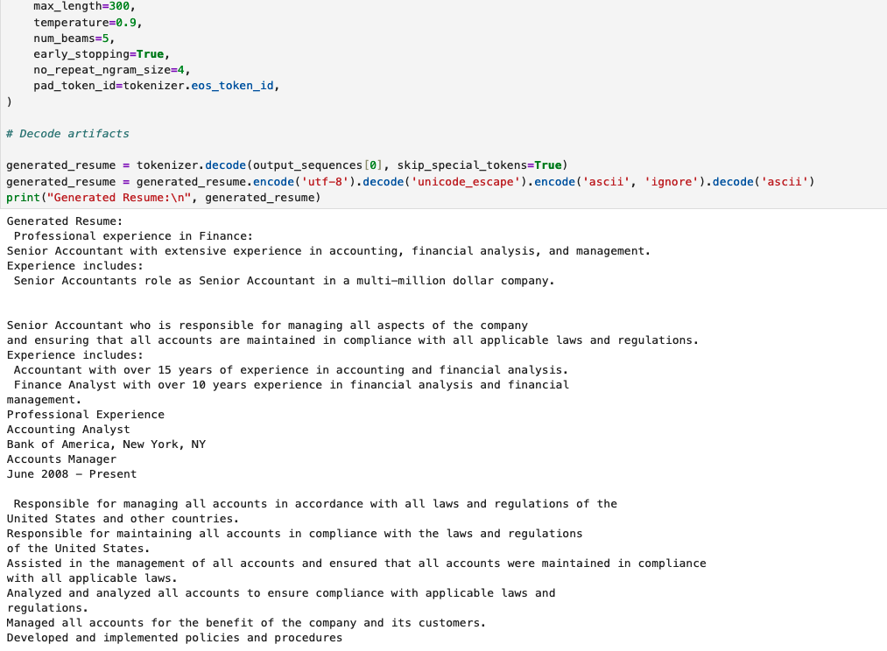
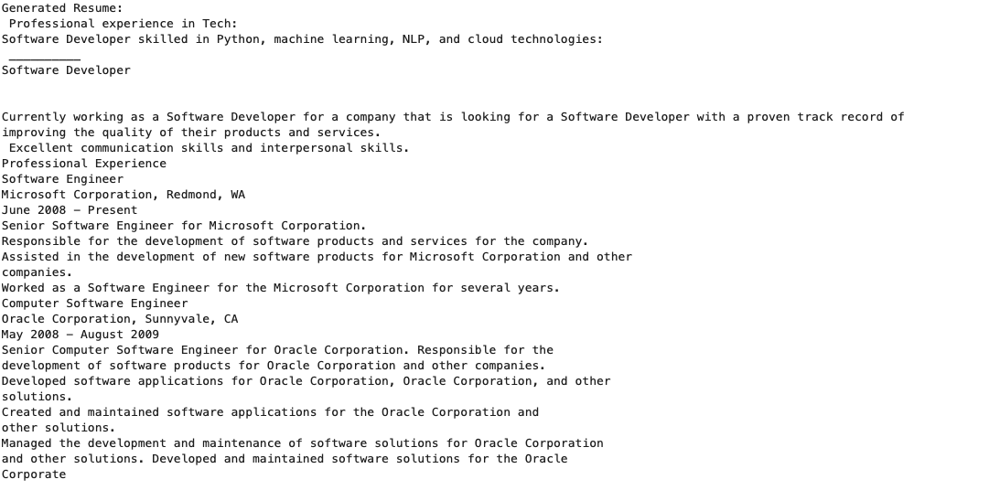
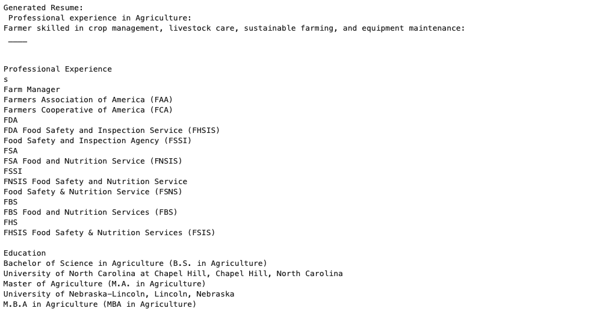

# Conditional Resume Generator: CGAN & Attention-based GAN

This repository showcases a research-driven NLP project leveraging **Conditional Generative Adversarial Networks (CGANs)** and **Attention Mechanisms** to generate synthetic professional resumes. The project specifically explores controlled, label-conditioned text generation using PyTorch, emphasizing model interpretability, training stability, and practical NLP applications.

## 📌 Project Overview

This project implements and compares two advanced generative architectures:

- **Conditional GAN (CGAN)**:
  - Incorporates label embedding for conditional generation
  - Employs adversarial training to guide realistic resume text synthesis

- **Attention-based GAN**:
  - Uses Multihead Attention to enhance context-sensitive generation
  - Implements Conditional Batch Normalization for improved conditioning and diversity

Both models generate professional resumes explicitly conditioned on specific job roles and industries, such as:
- **"Senior Analyst in Finance"**
- **"Software Developer in Tech"**

The project explicitly focuses on capturing professional tone, realistic formatting, coherent structure, and contextually relevant skill descriptions.

## 🎯 Objectives

- Evaluate the impact of conditional embeddings and attention mechanisms on structured NLP generation tasks
- Investigate GAN training strategies under conditions of limited labeled data
- Generate adversarially robust synthetic resumes to test downstream HR parsing systems (ATS, keyword matching algorithms)

## 🚀 Key Components

- **Conditional Label Embeddings**: Clearly guide GAN outputs to produce resumes relevant to specified roles or sectors
- **Multihead Attention**: Explicitly captures dependencies and context across generated resume tokens
- **Conditional Batch Normalization**: Improves training stability and diversity in text generation tasks
- **Orthogonal Regularization and Spectral Normalization**: Explicitly stabilize GAN training and reduce mode collapse

## 🧪 Prompt vs CGAN Output (Failure Case Gallery)

The CGAN was conditioned on simple prompts reflecting job titles and industries. Below are raw outputs from the model, revealing key failure patterns that motivate the shift to an Attention-based architecture.

 <table> <tr> <th>Prompt: "Senior Accountant in Finance"</th> <th>Prompt: "Software Developer in Tech"</th> <th>Prompt: "Farmer in Agriculture"</th> </tr> <tr> <td></td> <td></td> <td></td> </tr> </table> 

🧾 Actual Prompt Texts Used

<pre><code># Finance (used with category_name = 'Finance')
prompt_text = (
    "Professional experience in Finance:\n"
    "Senior Accountant with extensive experience in accounting, financial analysis, and management.\n"
    "Experience includes:\n"
)

# Tech (no explicit category label)
prompt_text = (
    "Professional experience in Tech:\n"
    "Software Developer skilled in Python, machine learning, NLP, and cloud technologies:\n• "
)

# Agriculture (no explicit category label)
prompt_text = (
    "Professional experience in Agriculture:\n"
    "Farmer skilled in crop management, livestock care, sustainable farming, and equipment maintenance:\n• "
)
</code></pre>

---

### 🔍 Common Issues Observed
- **Repetition of phrases or entities** (e.g., `"Oracle Corporation"`, `"FSNS"`, `"analyzed and analyzed"`)
- **Lack of coherent formatting or section structure**
- **Hallucinated acronyms and implausible organizational references**

## 🛠️ Technologies Used

- **PyTorch**: For flexible, GPU-accelerated neural network modeling
- **Hugging Face Transformers**: GPT-2 fine-tuning and NLP tokenization
- **scikit-learn & NumPy**: For preprocessing, evaluation, and metric tracking

## 📈 Future Directions

- Extend labeled training datasets to further enhance model robustness and output diversity
- Evaluate generated resumes against real-world ATS parsing and keyword-matching systems
- Explore integration with transformer-based language models for hybrid architectures

## 📖 References
- Brock et al. (2019). *Large Scale GAN Training for High Fidelity Natural Image Synthesis.* [arXiv](https://arxiv.org/abs/1809.11096)
- Mirza and Osindero (2014). *Conditional Generative Adversarial Nets.* [arXiv](https://arxiv.org/abs/1411.1784)

## 🚧 Project Status

Actively developing and experimenting with various GAN architectures and training strategies. Contributions and suggestions are welcome.

